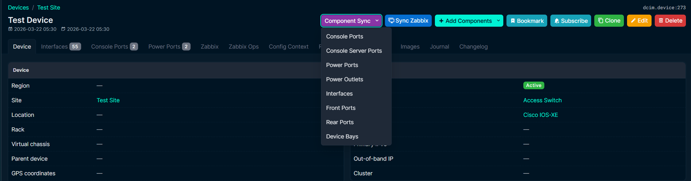
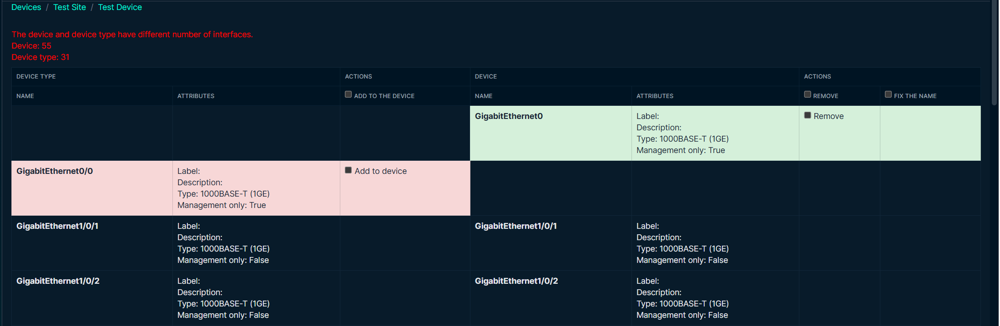

# netbox-interface-synchronization
## Overview
This plugin allows you to compare and synchronize interface names and types between devices and device types in NetBox. It can be useful for finding and correcting inconsistencies between interfaces when changing the device type.
## Compatibility
Tested with NetBox versions 4.0.0 - 4.3.1  This plugin is not compatible with Netbox 2 or 3
## Installation
If your NetBox 4 installation uses virtualenv, activate it like this:
```
source /opt/netbox/venv/bin/activate
```
Install the plugin from PyPI:
```
pip install netbox-interface-synchronization
```
or clone this repository, then go to the folder with it and install the plugin:
```
pip install .
```
To enable to plugin, add the plugin's name to the `PLUGINS` list in `configuration.py` (it's usually located in `/opt/netbox/netbox/netbox/`) like so:
```
PLUGINS = [
    'netbox_interface_synchronization'
]
```
Don't forget to restart NetBox:
```
sudo systemctl restart netbox
```
## Usage
To sync the interfaces, edit the device and set the new device type and save the device. Then find the "Sync Interfaces" button at the bottom of the page:

Mark the required actions with the checkboxes and click "Apply".

### Plugin Settings
If you want to override the default values, configure the `PLUGINS_CONFIG` in your `configuration.py`:
```
PLUGINS_CONFIG = {
    'netbox_interface_synchronization': {
        'exclude_virtual_interfaces': True
    }
}
```
| Setting | Default value | Description |
| --- | --- | --- |
| exclude_virtual_interfaces | `True` | Exclude virtual interfaces (VLANs, LAGs) from comparison
